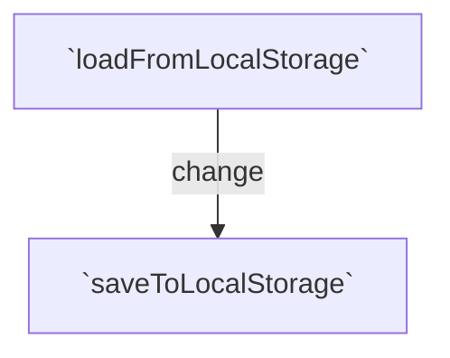

<!--MERMAID {width:100}-->

<!--MCONTENT {content: "graph TD \nA\\[`loadFromLocalStorage`<swm-token data-swm-token=\":src/core/persistence/localStoragePersistence.ts:5:4:4:`export const loadFromLocalStorage = &lt;S&gt;(key: string): S | null =&gt; {`\"/>\\] \\-\\-\\>|change| B\\[`saveToLocalStorage`<swm-token data-swm-token=\":src/core/persistence/localStoragePersistence.ts:1:4:4:`export const saveToLocalStorage = &lt;S&gt;(state: S, key: string): void =&gt; {`\"/>\\] \n \n\n "} --->

 

This file was generated by Swimm. [Click here to view it in the app](https://app.swimm.io/repos/Z2l0aHViJTNBJTNBdG8tZG8tbGlzdCUzQSUzQXRvbS1rb3JlYw==/docs/fs4t3nm9).
